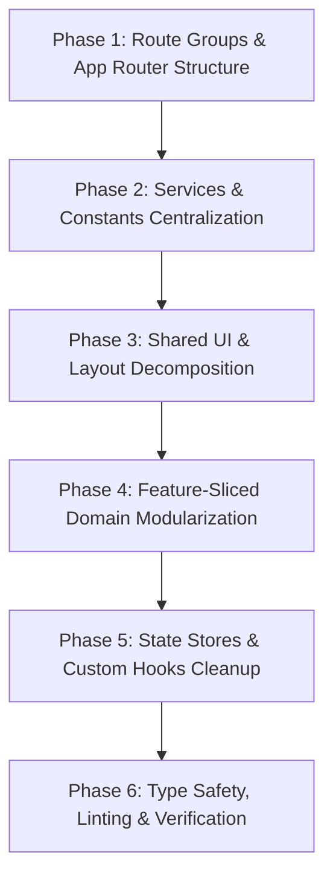

# Production-Level Folder Structure Refactoring Plan: `apps/web`

---

## 1. Executive Summary & Problem Statement

The **`apps/web`** frontend is a high-performance Next.js 15 and React 19 application powering the **Crack SDE** learning platform. As the application has grown to support complex domain capabilities—such as a 9-sprint roadmap planner, 847-question practice engine, spaced-repetition revision manager, multi-language sandbox, rich-text cheatsheets, and gamification—several architectural bottlenecks have emerged.

### Key Pain Points in Current Architecture

1. **Monolithic Page Files (Mega-Components):**
   - [`app/planly/page.tsx`](file:///d:/Antigravity/SDE%20Product/cracksde%20platform/apps/web/app/planly/page.tsx) (**1,424 lines**): Combines sprint timeline calculations, smart catch-up algorithms, task drawer UI, task mutation logic, daily hour sliders, and sprint edit dialogs into a single file.
   - [`app/prep-hub/page.tsx`](file:///d:/Antigravity/SDE%20Product/cracksde%20platform/apps/web/app/prep-hub/page.tsx) (**1,246 lines**): Mixes subject grid navigation, topic drawers, question tables, solution recording modals, and icons/theme mappings.
   - [`app/practice/page.tsx`](file:///d:/Antigravity/SDE%20Product/cracksde%20platform/apps/web/app/practice/page.tsx) (**946 lines**): Contains all filter state, pagination, table rendering, solve dialogs, notes inputs, and random question picking.
   - [`app/onboarding/page.tsx`](file:///d:/Antigravity/SDE%20Product/cracksde%20platform/apps/web/app/onboarding/page.tsx) (**776 lines**): Houses all 6 wizard steps in one component with hardcoded options and complex step transitions.
   - [`app/quiz-log/page.tsx`](file:///d:/Antigravity/SDE%20Product/cracksde%20platform/apps/web/app/quiz-log/page.tsx) (**754 lines**): Couples questions inventory with the new item creation form and dynamic topic selectors.
   - [`components/layout/header.tsx`](file:///d:/Antigravity/SDE%20Product/cracksde%20platform/apps/web/components/layout/header.tsx) (**448 lines**): Houses the entire hardcoded master search index and search scoring logic inline.

2. **Absence of Feature-Modular Grouping (Feature-Sliced Boundaries):**
   - Business logic, custom hooks, and domain sub-components are scattered across flat folders (`/hooks`, `/components/layout`, `/store`), making it difficult to maintain, test, and isolate features.

3. **Missing Next.js 15 App Router Best Practices:**
   - **Route Groups:** Lack of Route Groups (`(marketing)`, `(auth)`, `(app)`) forces conditional layout logic (e.g., [`navbar.tsx`](file:///d:/Antigravity/SDE%20Product/cracksde%20platform/apps/web/components/navbar.tsx) running manual pathname string checks).
   - **Server / Client Boundaries:** All page files currently use `"use client"` at the root, missing out on server-side rendering, metadata generation, and streaming benefits.
   - **Route Conventions:** Missing granular `loading.tsx`, `error.tsx`, and `not-found.tsx` files across nested route segments.

4. **Scattered Domain Constants & Raw API Endpoints:**
   - Domain constants (topics lists, code snippets, FAQ data, role lists) and raw API string URLs are hardcoded directly within page components rather than centralized in typed domain config and API service modules.

---

## 2. Target Production Architecture Overview

The refactoring architecture adopts a **Feature-Driven Modular Architecture** tailored for Next.js 15 (App Router).

```
apps/web/
├── app/                        # Routing & Layout Layer ONLY (Next.js 15 Route Groups)
│   ├── (marketing)/            # Public marketing routes (Landing, FAQ, Previews)
│   ├── (auth)/                 # Authentication routes (Login, Register, Forgot Password)
│   └── (app)/                  # Authenticated Core App routes (Dashboard, Planly, Practice, etc.)
├── features/                   # Domain-Driven Feature Modules (Colocated Logic & UI)
│   ├── auth/                   # Auth forms, session hooks, credentials validation
│   ├── onboarding/             # 6-Step roadmap generator wizard components & state
│   ├── dashboard/              # Donut progress meters, streak widgets, category summaries
│   ├── planly/                 # Sprints timeline, smart catch-up, day task drawers
│   ├── prep-hub/               # Subject tracks, topic drill-downs, revision status
│   ├── practice/               # Problem bank table, multi-facet filter bar, solve modals
│   ├── notes/                  # NoteSpace sidebar, cheatsheets, Tiptap editor integration
│   ├── codespace/              # In-browser sandbox, language presets, runner console
│   ├── quiz-log/               # Question manager & item creation form
│   ├── community/              # Discussion feeds, post cards, comments drawer
│   └── tools/                  # Bitwise operations visualizer & Big-O reference
├── components/                 # Global, Shared & Atomic UI (Domain-Agnostic)
│   ├── ui/                     # Primitives (Button, Dialog, Badge, Input, Card, etc.)
│   ├── layout/                 # Shell, Header, Sidebar, MobileNav, DailyPlanner
│   ├── editor/                 # Tiptap WYSIWYG core & formatting toolbars
│   ├── feedback/               # Global error boundaries, empty states, loading skeletons
│   └── search/                 # Master Command Palette (⌘K) & search index service
├── services/                   # Typed API Service Layer (HTTP Client & API Contracts)
├── hooks/                      # Global / Cross-Feature React Utility Hooks
├── store/                      # Global Cross-Cutting Zustand Stores (UI, Planner)
├── constants/                  # Platform-wide constants, navigation schemas, metadata
├── lib/                        # Low-level utilities, auth client, formatters
└── types/                      # Global & shared TypeScript type definitions
```

---

## 3. Comprehensive Target Directory Tree

```text
apps/web/
├── app/
│   ├── (marketing)/
│   │   ├── layout.tsx                  # Marketing layout with public Navbar & Footer
│   │   └── page.tsx                    # Lightweight Server Component page (SEO & Metadata)
│   ├── (auth)/
│   │   ├── layout.tsx                  # Centered auth card layout with security badges
│   │   ├── login/
│   │   │   └── page.tsx                # Renders <LoginForm /> from features/auth
│   │   └── register/
│   │       └── page.tsx                # Renders <RegisterForm /> from features/auth
│   ├── (app)/
│   │   ├── layout.tsx                  # Authenticated AppShell layout (Sidebar, Header, MobileNav)
│   │   ├── dashboard/
│   │   │   ├── page.tsx                # Renders <DashboardOverview />
│   │   │   └── loading.tsx             # Dashboard skeleton loader
│   │   ├── planly/
│   │   │   ├── page.tsx                # Renders <PlanlySprintPlanner />
│   │   │   ├── loading.tsx             # Sprint timeline skeleton loader
│   │   │   └── error.tsx               # Planly error boundary
│   │   ├── prep-hub/
│   │   │   ├── page.tsx                # Renders <PrepHubExplorer />
│   │   │   ├── loading.tsx             # PrepHub skeleton loader
│   │   │   └── error.tsx               # PrepHub error boundary
│   │   ├── practice/
│   │   │   ├── page.tsx                # Renders <PracticeQuestionBank />
│   │   │   └── loading.tsx             # Practice problem table skeleton
│   │   ├── onboarding/
│   │   │   └── page.tsx                # Renders <OnboardingWizard />
│   │   ├── notes/
│   │   │   ├── page.tsx                # Renders <NoteSpaceWorkspace />
│   │   │   └── loading.tsx             # NoteSpace skeleton
│   │   ├── codespace/
│   │   │   └── page.tsx                # Renders <CodespaceSandbox />
│   │   ├── quiz-log/
│   │   │   └── page.tsx                # Renders <QuizLogManager />
│   │   ├── lists/
│   │   │   └── page.tsx                # Renders <CuratedListsView />
│   │   ├── blogs/
│   │   │   └── page.tsx                # Renders <BlogsCatalog />
│   │   ├── tools/
│   │   │   └── page.tsx                # Renders <DeveloperTools />
│   │   ├── unlock/
│   │   │   └── page.tsx                # Renders <ProSubscriptionView />
│   │   └── community/
│   │       └── page.tsx                # Renders <CommunityDiscussions />
│   ├── favicon.ico
│   ├── globals.css                     # HSL design tokens, typography, dark mode base
│   ├── layout.tsx                      # Root HTML shell with ThemeProvider, QueryProvider & Toaster
│   ├── not-found.tsx                   # Global 404 handler with navigation recovery
│   └── error.tsx                       # Global fallback error boundary
│
├── features/                           # Domain Features (Modular Architecture)
│   ├── auth/
│   │   ├── components/
│   │   │   ├── login-form.tsx          # Login form with validation & loading state
│   │   │   └── register-form.tsx       # Registration form with password strength checks
│   │   ├── hooks/
│   │   │   └── use-auth-session.ts     # Session state & authorization helpers
│   │   ├── schemas/
│   │   │   └── auth-schema.ts          # Zod validation schemas for login & sign-up
│   │   └── types.ts                    # Auth-specific DTOs and form states
│   │
│   ├── onboarding/
│   │   ├── components/
│   │   │   ├── onboarding-wizard.tsx   # Master stepper controller
│   │   │   ├── step-about-you.tsx      # Step 1: Role, experience, company, region
│   │   │   ├── step-subjects.tsx       # Step 2: Subject track selection
│   │   │   ├── step-levels.tsx         # Step 3: Proficiency levels configuration
│   │   │   ├── step-review-topics.tsx  # Step 4: Curriculum exclusion & review
│   │   │   ├── step-availability.tsx   # Step 5: Day-by-day study hour sliders
│   │   │   ├── step-finalize.tsx       # Step 6: Plan name, start date & summary
│   │   │   └── onboarding-stepper.tsx  # Progress header stepper indicator
│   │   ├── store/
│   │   │   └── onboarding-store.ts     # Zustand store for wizard step data
│   │   ├── constants/
│   │   │   └── onboarding-options.ts   # Roles, experience tiers, companies, regions
│   │   └── types.ts                    # Onboarding state & payload interfaces
│   │
│   ├── dashboard/
│   │   ├── components/
│   │   │   ├── dashboard-overview.tsx  # Master container
│   │   │   ├── progress-donut.tsx      # Animated SVG radial progress meter
│   │   │   ├── sprint-status-card.tsx  # Active sprint summary & days remaining
│   │   │   ├── subject-progress-bar.tsx# Subject-level percentage meters (DSA, DBMS, OS)
│   │   │   ├── daily-stats-ribbon.tsx  # Hours studied, problems solved, streak counters
│   │   │   └── quick-actions-card.tsx  # Jump to active sprint / next problem
│   │   ├── hooks/
│   │   │   └── use-dashboard-stats.ts  # Computes aggregated progress metrics
│   │   └── types.ts
│   │
│   ├── planly/
│   │   ├── components/
│   │   │   ├── planly-sprint-planner.tsx# Main planner view
│   │   │   ├── sprint-timeline-card.tsx# Collapsible sprint header & progress meter
│   │   │   ├── day-task-drawer.tsx     # Accordion day drawer containing tasks
│   │   │   ├── task-item-row.tsx       # Individual study task with checkbox & revision badge
│   │   │   ├── smart-catchup-modal.tsx # Backlog task redistribution calculator
│   │   │   ├── sprint-edit-dialog.tsx  # Plan date/hours reconfiguration modal
│   │   │   └── sprint-metrics-panel.tsx# Estimated vs. actual time analytics
│   │   ├── hooks/
│   │   │   ├── use-study-plan.ts       # React Query hooks for fetching/mutating study plan
│   │   │   └── use-smart-catchup.ts    # Overdue tasks redistribution logic
│   │   ├── utils/
│   │   │   └── date-calculator.ts      # Sprint date interval & milestone formatters
│   │   └── types.ts
│   │
│   ├── prep-hub/
│   │   ├── components/
│   │   │   ├── prep-hub-explorer.tsx   # Master PrepHub coordinator
│   │   │   ├── subject-track-card.tsx  # Subject summary card (DSA, DBMS, OS, CN, OOPS, LLD)
│   │   │   ├── topic-drawer-modal.tsx  # Topic drawer listing all sub-modules
│   │   │   ├── topic-questions-list.tsx# Problem list within selected topic
│   │   │   ├── question-solve-modal.tsx# Question solve recording dialog with notes input
│   │   │   └── revision-status-card.tsx# Due / Upcoming / Completed spaced repetition tabs
│   │   ├── hooks/
│   │   │   ├── use-roadmap.ts          # Subject, topic, and revision React Query hooks
│   │   │   └── use-question-solver.ts  # Solve recording & cache invalidation mutation
│   │   ├── constants/
│   │   │   └── subject-theme-map.ts    # Subject color themes, badges, icons mapping
│   │   └── types.ts
│   │
│   ├── practice/
│   │   ├── components/
│   │   │   ├── practice-question-bank.tsx# Master practice repository view
│   │   │   ├── practice-filter-bar.tsx # Subject, topic, difficulty, status dropdowns & search
│   │   │   ├── practice-table.tsx      # Paginated, sortable problem list table
│   │   │   ├── practice-table-row.tsx  # Single problem row with status badges & actions
│   │   │   ├── random-problem-card.tsx # "Pick Random Problem" instant drawer
│   │   │   └── practice-pagination.tsx # Page size & navigation buttons
│   │   ├── hooks/
│   │   │   └── use-practice-filters.ts # URL search params sync with table filter state
│   │   ├── constants/
│   │   │   └── curriculum-topics.ts    # Complete mapped topics for all 6 subjects
│   │   └── types.ts
│   │
│   ├── notes/
│   │   ├── components/
│   │   │   ├── notespace-workspace.tsx # Master NoteSpace container
│   │   │   ├── notes-sidebar.tsx       # Searchable note list with tag filters
│   │   │   ├── note-card-item.tsx      # Note preview item in list
│   │   │   └── note-editor-panel.tsx   # Title input, tag selector & Tiptap integration
│   │   ├── hooks/
│   │   │   └── use-notes-storage.ts    # LocalStorage persistence & sync hook
│   │   └── types.ts
│   │
│   ├── codespace/
│   │   ├── components/
│   │   │   ├── codespace-sandbox.tsx   # Master editor & execution shell
│   │   │   ├── language-selector.tsx   # C++, Java, Python, JavaScript selector
│   │   │   ├── code-editor-window.tsx  # Syntax-highlighted code editor area
│   │   │   └── execution-console.tsx   # Stdin/Stdout terminal console with metrics
│   │   ├── constants/
│   │   │   └── default-snippets.ts     # Language boilerplate code templates
│   │   └── types.ts
│   │
│   ├── quiz-log/
│   │   ├── components/
│   │   │   ├── quiz-log-manager.tsx    # Master question inventory container
│   │   │   ├── create-question-dialog.tsx# Modal form to add custom practice questions
│   │   │   └── quiz-inventory-table.tsx# Table listing custom & existing questions
│   │   ├── schemas/
│   │   │   └── create-question-schema.ts# Zod validation schema for question inputs
│   │   └── types.ts
│   │
│   ├── community/
│   │   ├── components/
│   │   │   ├── community-discussions.tsx# Feed container
│   │   │   ├── post-card.tsx           # Discussion post with company tag & upvotes
│   │   │   ├── comments-thread.tsx     # Threaded replies list
│   │   │   └── create-post-dialog.tsx  # New experience share modal
│   │   └── types.ts
│   │
│   └── tools/
│       ├── components/
│       │   ├── developer-tools.tsx     # Master tools view
│       │   ├── bitwise-visualizer.tsx  # Bit arithmetic calculator with binary bits
│       │   └── big-o-cheatsheet.tsx    # Complexity table for data structures
│       └── types.ts
│
├── components/                         # Global, Reusable UI & Layout Components
│   ├── ui/                             # Atomic Design Primitives (shadcn/Radix)
│   │   ├── accordion.tsx
│   │   ├── badge.tsx
│   │   ├── button.tsx
│   │   ├── card.tsx
│   │   ├── checkbox.tsx
│   │   ├── dialog.tsx
│   │   ├── dropdown-menu.tsx           # (New) Accessible dropdown menu
│   │   ├── input.tsx
│   │   ├── label.tsx
│   │   ├── progress.tsx
│   │   ├── separator.tsx
│   │   ├── skeleton.tsx
│   │   ├── slider.tsx
│   │   ├── tabs.tsx
│   │   └── tooltip.tsx                 # (New) Accessible tooltip component
│   │
│   ├── layout/                         # Authenticated & Shared Layout Shells
│   │   ├── app-shell.tsx               # Master AppShell with responsive margin sync
│   │   ├── sidebar.tsx                 # Collapsible sidebar with grouped navigation
│   │   ├── header.tsx                  # Top navigation bar with ⌘K trigger & streak
│   │   ├── mobile-nav.tsx              # Bottom mobile navigation bar
│   │   ├── navbar.tsx                  # Public marketing navigation header
│   │   ├── footer.tsx                  # (New) Public marketing footer
│   │   └── daily-planner/              # Decomposed Daily Planner Widget
│   │       ├── daily-planner-widget.tsx# Main widget container
│   │       ├── problem-of-the-day.tsx  # Problem of the Day countdown & solve CTA
│   │       ├── task-list.tsx           # Daily task items with completion checkboxes
│   │       └── add-task-inline-form.tsx# Inline quick-add form with duration/category
│   │
│   ├── search/                         # Universal Command Palette (⌘K)
│   │   ├── command-palette-dialog.tsx  # Search modal dialog
│   │   ├── search-result-item.tsx      # Categorized search row item
│   │   └── search-index.ts             # Master searchable catalog & scoring logic
│   │
│   ├── editor/                         # Rich-Text WYSIWYG Editor
│   │   ├── tiptap-editor.tsx           # Tiptap React wrapper
│   │   └── tiptap-toolbar.tsx          # Formatting action buttons
│   │
│   └── feedback/                       # Feedback, Skeletons & Boundaries
│       ├── empty-state.tsx             # Generic empty state with illustration & CTA
│       ├── error-state.tsx             # Error boundary fallback display
│       └── page-skeleton.tsx           # Full-page layout loading placeholder
│
├── services/                           # Typed API Client & Endpoint Services
│   ├── api-client.ts                   # Core Fetch client instance with error handling
│   ├── auth-service.ts                 # Better-Auth client integration
│   ├── study-plan-service.ts           # Endpoints for plans, sprints, tasks & revisions
│   ├── roadmap-service.ts              # Endpoints for subjects, topics & practice items
│   └── community-service.ts            # Endpoints for posts, comments & upvotes
│
├── store/                              # Cross-Cutting Global Client State (Zustand)
│   ├── ui-store.ts                     # Sidebar collapse, active tab rect, mobile drawer
│   └── planner-store.ts                # Daily planner tasks, study points, streak check-in
│
├── hooks/                              # Global React Utility Hooks
│   ├── use-debounce.ts                 # (New) Input debounce for search & filters
│   ├── use-local-storage.ts            # (New) Type-safe localStorage manager
│   ├── use-media-query.ts              # (New) Responsive breakpoint detection
│   └── use-keyboard-shortcut.ts        # (New) Declarative key combination listeners
│
├── constants/                          # Global App Constants & Config
│   ├── navigation.ts                   # Sidebar & Navbar link definitions
│   ├── routes.ts                       # Typed route paths & route matcher patterns
│   └── site-config.ts                  # App metadata, title, description, SEO defaults
│
├── lib/                                # Core Utilities
│   ├── utils.ts                        # `cn` helper (clsx + tailwind-merge)
│   └── formatters.ts                   # Date, duration, numbers, and percentage formatters
│
└── types/                              # Global TypeScript Interfaces
    ├── api.ts                          # Standard API response wrappers
    ├── navigation.ts                   # Navigation link schemas
    └── index.ts                        # Barrel export for shared types
```

---

## 4. Before-and-After File Decomposition Matrix

| Existing File (Current) | Current Lines | New Modular Target Files | Target Responsibility |
| :--- | :---: | :--- | :--- |
| **`app/planly/page.tsx`** | **1,424** | • `app/(app)/planly/page.tsx`<br/>• `features/planly/components/planly-sprint-planner.tsx`<br/>• `features/planly/components/sprint-timeline-card.tsx`<br/>• `features/planly/components/day-task-drawer.tsx`<br/>• `features/planly/components/task-item-row.tsx`<br/>• `features/planly/components/smart-catchup-modal.tsx`<br/>• `features/planly/components/sprint-edit-dialog.tsx`<br/>• `features/planly/hooks/use-smart-catchup.ts`<br/>• `features/planly/utils/date-calculator.ts` | • Page route wrapper<br/>• Main container orchestration<br/>• Sprint milestone header & progress<br/>• Day accordion drawer<br/>• Task completion toggle row<br/>• Catch-up redistribution algorithm<br/>• Plan configuration modal<br/>• Backlog reallocation logic<br/>• Date math and formatting |
| **`app/prep-hub/page.tsx`** | **1,246** | • `app/(app)/prep-hub/page.tsx`<br/>• `features/prep-hub/components/prep-hub-explorer.tsx`<br/>• `features/prep-hub/components/subject-track-card.tsx`<br/>• `features/prep-hub/components/topic-drawer-modal.tsx`<br/>• `features/prep-hub/components/topic-questions-list.tsx`<br/>• `features/prep-hub/components/question-solve-modal.tsx`<br/>• `features/prep-hub/constants/subject-theme-map.ts` | • Page route wrapper<br/>• Main container orchestration<br/>• Subject track cards grid<br/>• Topic selection drawer<br/>• Question table with solve status<br/>• Question solve modal with notes<br/>• Subject visual theme definitions |
| **`app/practice/page.tsx`** | **946** | • `app/(app)/practice/page.tsx`<br/>• `features/practice/components/practice-question-bank.tsx`<br/>• `features/practice/components/practice-filter-bar.tsx`<br/>• `features/practice/components/practice-table.tsx`<br/>• `features/practice/components/practice-table-row.tsx`<br/>• `features/practice/components/random-problem-card.tsx`<br/>• `features/practice/hooks/use-practice-filters.ts`<br/>• `features/practice/constants/curriculum-topics.ts` | • Page route wrapper<br/>• Master practice container<br/>• Search & multi-dropdown filter bar<br/>• Paginated table container<br/>• Interactive problem row<br/>• Random question modal<br/>• URL params synchronization<br/>• Mapped topics for all 6 subjects |
| **`app/onboarding/page.tsx`** | **776** | • `app/(app)/onboarding/page.tsx`<br/>• `features/onboarding/components/onboarding-wizard.tsx`<br/>• `features/onboarding/components/step-about-you.tsx`<br/>• `features/onboarding/components/step-subjects.tsx`<br/>• `features/onboarding/components/step-levels.tsx`<br/>• `features/onboarding/components/step-review-topics.tsx`<br/>• `features/onboarding/components/step-availability.tsx`<br/>• `features/onboarding/components/step-finalize.tsx`<br/>• `features/onboarding/constants/onboarding-options.ts` | • Page route wrapper<br/>• Stepper coordinator<br/>• Step 1: User background<br/>• Step 2: Subject tracks selection<br/>• Step 3: Proficiency levels<br/>• Step 4: Curriculum exclusions<br/>• Step 5: Daily hour allocation<br/>• Step 6: Confirmation & creation<br/>• Roles & experience presets |
| **`app/quiz-log/page.tsx`** | **754** | • `app/(app)/quiz-log/page.tsx`<br/>• `features/quiz-log/components/quiz-log-manager.tsx`<br/>• `features/quiz-log/components/create-question-dialog.tsx`<br/>• `features/quiz-log/components/quiz-inventory-table.tsx`<br/>• `features/quiz-log/schemas/create-question-schema.ts` | • Page route wrapper<br/>• Main inventory container<br/>• Custom question creation form<br/>• Paginated questions table<br/>• Zod form validation schema |
| **`app/notes/page.tsx`** | **464** | • `app/(app)/notes/page.tsx`<br/>• `features/notes/components/notespace-workspace.tsx`<br/>• `features/notes/components/notes-sidebar.tsx`<br/>• `features/notes/components/note-card-item.tsx`<br/>• `features/notes/components/note-editor-panel.tsx`<br/>• `features/notes/hooks/use-notes-storage.ts` | • Page route wrapper<br/>• Dual-pane workspace container<br/>• Searchable note list sidebar<br/>• Note preview item<br/>• Active note editor panel<br/>• LocalStorage sync hook |
| **`components/layout/header.tsx`** | **448** | • `components/layout/header.tsx`<br/>• `components/search/command-palette-dialog.tsx`<br/>• `components/search/search-result-item.tsx`<br/>• `components/search/search-index.ts` | • Slim header with triggers<br/>• Accessible ⌘K modal dialog<br/>• Categorized result row item<br/>• Search index catalog & scoring |
| **`components/layout/daily-planner.tsx`** | **372** | • `components/layout/daily-planner/daily-planner-widget.tsx`<br/>• `components/layout/daily-planner/problem-of-the-day.tsx`<br/>• `components/layout/daily-planner/task-list.tsx`<br/>• `components/layout/daily-planner/add-task-inline-form.tsx` | • Main widget container<br/>• Problem of the Day card<br/>• Daily task item list<br/>• Inline quick task form |

---

## 5. Step-by-Step Phased Implementation Roadmap



### Phase 1: Route Groups & App Router Restructuring
1. Create Route Groups:
   - `app/(marketing)/` for public landing (`page.tsx`, `layout.tsx`).
   - `app/(auth)/` for `login` and `register` pages with a clean centered layout.
   - `app/(app)/` for authenticated routes wrapping `AppShell` automatically.
2. Remove pathname-based conditional checks from `components/layout/navbar.tsx` because layout rendering will now be handled natively by Route Groups.
3. Add route-level `loading.tsx` and `error.tsx` templates for smooth loading transitions and resilient error boundaries.

### Phase 2: API Services, Zod Schemas & Constants Layer
1. Extract raw fetch calls into typed service classes in `services/`:
   - `study-plan-service.ts`
   - `roadmap-service.ts`
   - `community-service.ts`
2. Create domain constants in `constants/` (e.g. `curriculum-topics.ts`, `navigation.ts`, `onboarding-options.ts`, `default-snippets.ts`).
3. Add Zod schemas for form validations (`auth-schema.ts`, `create-question-schema.ts`).

### Phase 3: Shared UI & Layout Decomposition
1. Refactor [`components/layout/header.tsx`](file:///d:/Antigravity/SDE%20Product/cracksde%20platform/apps/web/components/layout/header.tsx):
   - Move search index to `components/search/search-index.ts`.
   - Extract search dialog into `components/search/command-palette-dialog.tsx`.
2. Decompose [`components/layout/daily-planner.tsx`](file:///d:/Antigravity/SDE%20Product/cracksde%20platform/apps/web/components/layout/daily-planner.tsx) into sub-components (`problem-of-the-day.tsx`, `task-list.tsx`, `add-task-inline-form.tsx`).
3. Relocate editor components into `components/editor/`.

### Phase 4: Feature-Sliced Domain Modularization
1. **Planly Module Refactor**:
   - Break `app/planly/page.tsx` into modular components under `features/planly/components/`.
   - Separate smart catch-up calculations into `features/planly/hooks/use-smart-catchup.ts`.
2. **Prep Hub Module Refactor**:
   - Break `app/prep-hub/page.tsx` into modular components under `features/prep-hub/components/`.
   - Move theme mappings to `features/prep-hub/constants/subject-theme-map.ts`.
3. **Practice Module Refactor**:
   - Break `app/practice/page.tsx` into filter bar, table, row, and pagination components under `features/practice/components/`.
   - Sync URL query parameters via `use-practice-filters.ts`.
4. **Onboarding Module Refactor**:
   - Break `app/onboarding/page.tsx` into discrete step components (`step-1` through `step-6`).
5. **Quiz Log & Notes Refactor**:
   - Decompose question creation form and NoteSpace dual-pane workspace.

### Phase 5: State Stores & Custom Hooks Optimization
1. Move feature-specific stores (like `onboarding-store.ts`) into `features/onboarding/store/`.
2. Retain only true cross-cutting stores in `store/` (`ui-store.ts`, `planner-store.ts`).
3. Refactor React Query hooks to use typed functions from `services/`.

### Phase 6: Verification, Type-Checking & Quality Assurance
1. Run `npm run typecheck` (`tsc --noEmit`) to verify 100% type coverage and zero broken imports.
2. Verify Next.js build: `npm run build`.
3. Verify client functionality:
   - Navigation transitions between all routes.
   - Command palette (⌘K) quick navigation.
   - Task completion and points logging in daily planner.
   - Onboarding 6-step study plan generation flow.
   - Question solve recording and spaced repetition tracking.

---

## 6. TypeScript Path Aliases (`tsconfig.json`)

Update `tsconfig.json` path mappings to support clean feature-level imports:

```json
{
  "compilerOptions": {
    "baseUrl": ".",
    "paths": {
      "@/*": ["./*"],
      "@/features/*": ["./features/*"],
      "@/components/*": ["./components/*"],
      "@/services/*": ["./services/*"],
      "@/hooks/*": ["./hooks/*"],
      "@/store/*": ["./store/*"],
      "@/constants/*": ["./constants/*"],
      "@/lib/*": ["./lib/*"],
      "@/types/*": ["./types/*"]
    }
  }
}
```

---

## 7. Migration Safety & Risk Mitigation

| Risk | Mitigation Strategy |
| :--- | :--- |
| **Breaking Imports during refactor** | Implement changes incrementally feature-by-feature; run `npm run typecheck` after each decomposed component. |
| **State desynchronization** | Maintain existing Zustand store state contracts (`planner-store.ts`, `onboarding-store.ts`) and React Query cache keys (`["study-plan"]`, `["practice-problems"]`, `["roadmap-subjects"]`). |
| **Next.js Hydration Mismatches** | Ensure components relying on `localStorage` (such as `DailyPlanner` and `NoteSpace`) retain `isMounted` checks before rendering dynamic client data. |
| **Route 404s after Route Group creation** | Next.js route groups `(marketing)`, `(auth)`, `(app)` are purely organizational and do NOT affect URL paths (e.g., `app/(app)/dashboard/page.tsx` resolves to `/dashboard`). |
